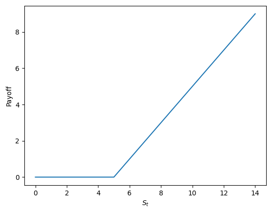
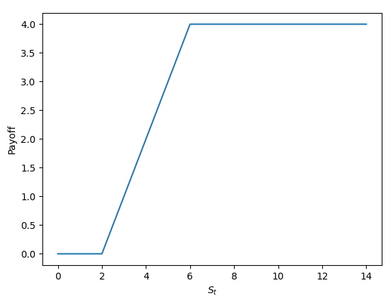

# ExerciceFinance

=> Payoff Call :

Le Payoff d’un call est défini comme suivant : Payoff = max( 0, St - k )
, avec St le prix du sous-jacent à l’échéance et k le prix d’exercice

Pour St <= k, Payoff = 0 ; sinon Payoff = x – k.

Exemple : Pour k = 5 :

On peut voir qu’on aura un rendement croissant dès que x > k et que celui-ci est sans limite.

=> Payoff Call Spread :

Un Call Spread est l’achat d’un Call suivi de la ventre d’un Call sur un actif financier.

Payoff call k1 : Payoff = max( 0, St – k1 )

Payoff call k2 : Payoff = max( 0, St – k2 )

Le Payoff d’un Call Spread va donc être défini comme suivant : 
Payoff = max( 0, St – k1 ) – max( 0, St – k2 )

- St < k1 => Payoff = 0
- K1 <= St <= k2 => Payoff = St – k1, car max( 0, St – k2 ) = 0
- St > k2, Payoff = (x – k1) – (x – k2) = x – k1 – x + k2 = k2 – k1

Exemple : Pour k1 = 2, k2 = 6

On peut voir qu’on aura un payoff croissant entre k1 et k2, puis celui-ci sera plafonné quand St est supérieur à k2. 

Conclusion :

Un Call Simple peut avoir un payoff illimité, ce qui le rend plus coûteux en coût initial qu’un Call spread, dont le coût est partiellement compensé par la vente d’un call. Cependant, le Call Spread aura un payoff limité à k2 – k1.
